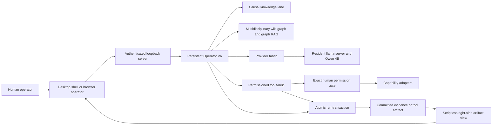
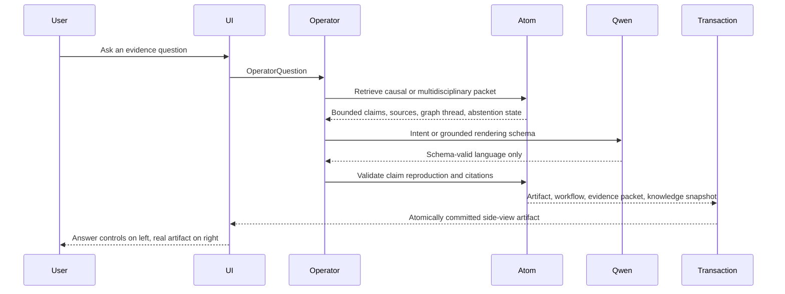
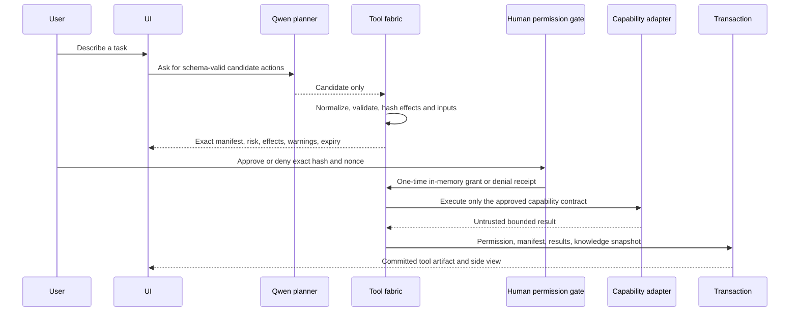

# Atom Harness Developer and Reconstruction Guide

This is the canonical engineering guide for Atom Harness Desktop Phase 7 and
Atom Harness Operator V6. It is written so that a developer who did not
participate in the original work can clone the repository, provision the exact
runtime, understand every authority boundary, run the project, verify it,
package it, and extend it without silently changing the experiment.

The guide describes the implementation represented by the Phase 7 source and
release evidence. The implementation baseline inspected for this guide was
commit `f390cd26e6e477b0c114c3df98c2613ef72c67a9` on `main`. Documentation-only
commits may follow that implementation baseline.

## 1. Reconstruction target

A successful reconstruction produces all of the following:

1. A source checkout under `C:\Projects\atom-harness`.
2. A Python 3.13 environment that can run every harness test.
3. The exact admitted Qwen GGUF model outside the repository.
4. A compatible `llama-server` executable.
5. A source-launched Operator V6 that preloads the model and both knowledge
   lanes before accepting requests.
6. A Windows x64 desktop shell that supervises the backend and shows the real
   committed artifact beside the operator controls.
7. A permissioned-hands flow that cannot execute until the human approves an
   exact, hashed, one-time manifest.
8. A content-addressed, immutable multidisciplinary knowledge pack and a
   separate causal-experience lane.
9. Crash-safe request and tool-run transactions with verifiable artifacts.
10. A portable ZIP and per-user MSI created by the repository packaging entry
    point.
11. Passing source policy, integration, Python, .NET, Rust, packaging, and
    frozen-backend checks.

Reconstruction means reproducing the functional system and its verification
contract. It does not promise that a newly generated ZIP or MSI will have the
same byte hash as an older package. Archive timestamps, native tool versions,
and compiler output can change package bytes. The release evidence records the
exact hashes of the certified Phase 7 artifacts.

## 2. Product identity

Atom Harness is not a general chatbot with tools attached. It is an evidence
and authority harness in which responsibilities are deliberately separated.

| Actor | Owns | Must never own |
| --- | --- | --- |
| Atom | Evidence, causal memory, wiki graphs, graph RAG, claim identity, source identity, routing policy, abstention, transactions | Natural-language fluency as the source of truth |
| Qwen | Language rendering and proposal-only action planning | Facts, permission, direct tool handles, Atom memory writes, evidence promotion |
| Permissioned tool fabric | Validation and execution of registered capability contracts | Self-authorization or policy changes from tool output |
| Human operator | The final decision to approve or deny each exact action manifest | Hidden or implied approval |
| Desktop shell | Process supervision, model provisioning, trusted controls, artifact presentation, opt-in updates | Semantic authority or a second copy of the artifact |

The active identities are:

| Surface | Identity |
| --- | --- |
| Product | Atom Harness Desktop Phase 7 |
| Desktop runtime | `atom-harness-desktop-v7` |
| Desktop version | `7.0.0` |
| Active authority runtime | `language-harness-v6` |
| Operator server | `atom-harness-operator-loopback-server-v3` |
| Resident language lane | `atom-resident-language-lane-v1` |
| Knowledge pack | `atom-universal-foundation-v1`, version `1.0.0` |
| Run transaction | `atom-run-transaction-v2` |
| Update client | `lucerna-release-client-v1` |
| Platform | Windows x64 |

`ai-runtime-registry.json` is the source of truth for the active runtime. Do not
select an older runtime because a historical document, output folder, or
internal version label still contains V3, V4, or V5.

## 3. Non-negotiable invariants

The following are architectural requirements, not implementation suggestions.

1. Atom remains the semantic authority.
2. The local language model may render grounded language and propose actions.
   It may not create evidence, promote claims, grant permission, invoke tools
   directly, or mutate Atom memory.
3. Unknown knowledge must abstain. Fluent completion is not a substitute for a
   retrieved Atom claim.
4. Causal experience and multidisciplinary reference knowledge remain separate
   lanes. A definition, literary interpretation, or craft heuristic must not be
   forced into a causal-record schema.
5. Formal, empirical, contextual, interpretive, fictional, and craft material
   retain distinct claim types and epistemic statuses.
6. Retrieved text and tool output are untrusted data. Neither can authorize an
   action, modify policy, or become evidence by assertion.
7. Every tool execution requires a fresh human approval of the exact manifest
   hash and decision nonce shown in the trusted interface.
8. A permission grant is in memory, one-time, expiring, and non-replayable.
9. A changed manifest, changed file hash, changed executable hash, changed
   resolved web address, expired grant, or missing argument fails closed.
10. Every completed request and tool run is committed atomically and includes a
    manifest that hashes its files.
11. The real committed artifact must render in the user-visible side view. A UI
    summary is not a substitute.
12. The operator binds only to IPv4 loopback and uses an in-memory access token.
13. Operator V6 is local-only. Cloud routing is not enabled by the operator.
14. Model weights are admitted only after exact byte-count and SHA-256 checks.
15. Updates are opt-in. The application asks before download and again before
    installation, verifies size and SHA-256, stages outside the install
    directory, exits before replacement, and keeps rollback material.
16. The Phase 6 hands and the Ornith 1.0 capability floor must not be narrowed
    by later knowledge or desktop work.
17. A released knowledge pack is immutable. Create a new version directory for
    changed data instead of editing `universal-foundation-v1` in place.

## 4. System architecture



The Spiderweb flow is layered:

| Layer | Purpose in Atom Harness |
| --- | --- |
| L0 | Process, byte, file, socket, and cancellation transport |
| L1 | Typed messages, claim packets, proposal manifests, receipts, results |
| L2 | Request flow, graph retrieval, provider lanes, queue pressure, transactions |
| L3 | Atom policy, abstention, human permission, source rights, artifact authority |

Do not replace this with an untyped event bus. The typed ramps, policy layer,
and visible flow evidence are part of the experiment.

### 4.1 Evidence request flow



### 4.2 Permissioned-hands flow



## 5. Repository map

The repository intentionally contains the active product and earlier research
lanes. Start with the active files below.

### 5.1 Runtime declarations and contracts

| File | Responsibility |
| --- | --- |
| `ai-runtime-registry.json` | Selects `language-harness-v6` and binds its entrypoints, runtime markers, tests, and certificates |
| `ai-runtime-knowledge.json` | Declares the required wiki graph and RAG lanes |
| `ai-artifact-side-view.json` | Declares the user-visible artifact binding and sandbox expectations |
| `ai-provider-fabric.json` | Declares local provider, preload, queue, recovery, and transport properties |
| `ai-tool-fabric.json` | Declares permissioned-hands and fail-closed execution properties |
| `ai-run-transaction.json` | Declares staged writes, atomic publication, locking, recovery, and journals |
| `atom-language-model.json` | Pins the admitted model, hash, backend, prompt transport, and resident-lane policy |
| `atom-language-harness-architecture.json` | Machine-readable Operator V6 architecture |
| `atom-harness-desktop-architecture.json` | Machine-readable Phase 7 desktop and release architecture |
| `lucerna-update.json` | Opt-in update policy and release feed location |

### 5.2 Active Python runtime

| File | Responsibility |
| --- | --- |
| `atom_harness_operator_server.py` | Loopback HTTP server, route guards, API dispatch, cookies, CSP, startup and shutdown |
| `atom_harness_operator_ui.py` | Trusted operator controls and the side-by-side browser surface |
| `atom_harness_operator.py` | Persistent queues, request journal, retries, cancellation, recovery, and tool orchestration |
| `atom_harness_session.py` | Resident session, one-time knowledge preload, provider preload, request output allocation |
| `atom_harness_experiment.py` | End-to-end evidence request, grounding, checks, transaction contents, artifact creation |
| `atom_harness_runtime.py` | Atom language harness runtime and evidence-grounded response boundary |
| `atom_harness_knowledge.py` | Causal wiki graph and RAG integration plus combined knowledge snapshot |
| `atom_multidisciplinary_knowledge.py` | Immutable Phase 7 pack validation, wiki graph construction, graph-first retrieval, source and claim schemas |
| `atom_knowledge_protocol.py` | Typed knowledge packet protocol shared across runtime surfaces |
| `atom_provider_fabric.py` | Ordered provider routing, cancellation, concurrency, circuit and pressure signals |
| `atom_resident_language_lane.py` | Authenticated resident `llama-server` lifecycle and completion transport |
| `atom_llm_protocol.py` | Provider contracts, cancellation token, structured completion types |
| `atom_tool_fabric.py` | Proposal state machine, exact permission grants, execution, journals, artifacts |
| `atom_tool_protocol.py` | Typed tool proposal, manifest, permission, and result contracts |
| `atom_tool_capabilities.py` | Registered adapters and all path, hash, process, and network enforcement |
| `atom_tool_side_view.py` | Real tool artifact renderer |
| `atom_run_transaction.py` | Lock, staging, seal, atomic commit, validation, and crash recovery |
| `atom_harness_side_view.py` | Evidence artifact renderer used by the committed transaction |
| `atom_harness_desktop_backend.py` | Frozen backend entrypoint used by the desktop package |

### 5.3 Knowledge and causal memory

| Path | Responsibility |
| --- | --- |
| `knowledge_packs/universal-foundation-v1/` | Content-addressed multidisciplinary foundation pack |
| `primitive_forge_outputs/atom_primitive_graph.json` | Primitive graph input for the causal knowledge lane |
| `causal_world_outputs/` | Certified causal evidence and model inputs |
| `atom_causal_memory_rust/` | Bundled Rust causal-memory runtime and its experiments |
| `atom_causal_memory.py` and related modules | Python-facing causal memory and retrieval integration |

### 5.4 Desktop and release

| Path | Responsibility |
| --- | --- |
| `desktop/AtomHarness.Desktop/` | .NET 9 WinForms shell and WebView2 host |
| `desktop/AtomHarness.Desktop.Core/` | Shared integrity, model, release, and updater contracts |
| `desktop/AtomHarness.Desktop.Tests/` | Desktop integrity and update safety tests |
| `desktop/AtomHarness.Updater/` | Out-of-process update installer |
| `desktop/packaging/` | WiX MSI source and per-user harvesting transform |
| `atom-harness-backend.spec` | PyInstaller frozen-backend contents and exclusions |
| `scripts/build_atom_harness_desktop.ps1` | Complete release build and packaging entrypoint |
| `atom-harness-desktop-release-evidence.json` | Exact evidence for the certified Phase 7 package and installed run |

### 5.5 Verification

| Path | Responsibility |
| --- | --- |
| `tests/test_atom_universal_knowledge_integration.py` | Declared Phase 7 integration gate across wiki, RAG, side views, and Phase 6 regression |
| `tests/test_atom_permissioned_hands.py` | Adversarial permission and capability tests |
| `tests/test_atom_permissioned_hands_integration.py` | Real loopback hands workflow with scripted language output |
| `tests/test_atom_harness_desktop_v7_integration.py` | Desktop source, package, and installed-layout contract checks |
| `scripts/verify_atom_harness_v7.py` | Fail-closed Phase 7 policy, certificate, and release verifier |
| `scripts/certify_atom_universal_knowledge.py` | Source-bound Phase 7 certification generator |
| `.github/workflows/atom-harness-v7-ci.yml` | Full-SHA-pinned Windows CI workflow |

Earlier experiments and V2 through V6 verifiers are retained for provenance and
regression. They are not the active Phase 7 entrypoint.

## 6. Exact external prerequisites

The certified development machine used these versions:

| Component | Version or constraint | Why it is needed |
| --- | --- | --- |
| Windows | Windows x64 with WebView2 Runtime | Desktop target and embedded operator UI |
| Git | Any current release; inspected machine had 2.52.0 | Source checkout |
| Python | 3.13; inspected machine had 3.13.13 | Tests, runtime, certification, PyInstaller |
| NumPy | 2.4.6 for development, runtime accepts 2.0 or newer | Harness numerical modules |
| PyInstaller | 6.21.0 exactly | Frozen backend packaging |
| Ruff | 0.13.0 exactly | Python formatting and lint |
| PyTorch | 2.10.0 exactly for full research test coverage | Historical and research experiments, not the frozen Phase 7 backend |
| Node.js | Major 24; inspected machine had 24.11.0 | Svelte validator and full repository support |
| .NET SDK | 9.0.305 exactly | Desktop, updater, and tests; pinned by `global.json` |
| Rust | 1.96.0 with Clippy and rustfmt | Bundled causal-memory runtime; pinned by `rust-toolchain.toml` |
| llama.cpp | `llama-server` build 10173 in the certified release | Resident local model server |
| WiX Toolset | 3.14, installed at the standard Program Files x86 path | MSI generation |
| WebView2 SDK package | 1.0.4078.44 | Desktop build, centrally pinned |
| WebView2 Runtime | 150.0.4078.105 in installed release evidence | User-facing embedded browser runtime |

Important Python detail: the machine's default `python` may not be Python 3.13.
Use `py -3.13` for source verification. The packaging script deliberately
requires the per-user executable at:

```text
%LOCALAPPDATA%\Programs\Python\Python313\python.exe
```

The following package IDs match the inspected Windows setup and are useful on a
clean machine:

```powershell
winget install --exact --id Git.Git
winget install --exact --id Python.Python.3.13
winget install --exact --id OpenJS.NodeJS.LTS
winget install --exact --id Rustlang.Rustup
winget install --exact --id ggml.llamacpp
winget install --exact --id WiXToolset.WiXToolset
```

Install .NET SDK 9.0.305 from Microsoft if that exact SDK is not already
present. Verify all tools before continuing:

```powershell
git --version
py -3.13 --version
node --version
dotnet --version
rustc --version
cargo --version
llama-server --version
```

Expected important identities are `9.0.305` for .NET and `1.96.0` for Rust.
`llama-server` may be upgraded only after rerunning resident-lane certification
and release verification because backend behavior is part of the admitted
language transport.

## 7. Clean checkout and dependency setup

All active project work belongs under `C:\Projects`.

```powershell
New-Item -ItemType Directory -Path C:\Projects -Force | Out-Null
git clone https://github.com/Lucerna-Labs/atom-harness.git C:\Projects\atom-harness
Set-Location C:\Projects\atom-harness
git status --short
```

The final command should print nothing.

Create a source-development virtual environment:

```powershell
Set-Location C:\Projects\atom-harness
py -3.13 -m venv .venv
.\.venv\Scripts\Activate.ps1
python -m pip install --upgrade pip
python -m pip install -r requirements-dev.txt
```

The virtual environment is convenient for tests. It does not replace the exact
per-user Python path required by the desktop packaging script.

Install and lock the other dependency sets:

```powershell
npm --prefix tooling\svelte-validator ci

dotnet restore desktop\AtomHarness.Desktop.Core\AtomHarness.Desktop.Core.csproj --locked-mode
dotnet restore desktop\AtomHarness.Desktop\AtomHarness.Desktop.csproj --locked-mode
dotnet restore desktop\AtomHarness.Updater\AtomHarness.Updater.csproj --locked-mode
dotnet restore desktop\AtomHarness.Desktop.Tests\AtomHarness.Desktop.Tests.csproj --locked-mode

rustup toolchain install 1.96.0 --profile minimal --component clippy,rustfmt
cargo fetch --manifest-path atom_causal_memory_rust\Cargo.toml --locked
```

Do not casually regenerate any `packages.lock.json`, `package-lock.json`, or
`Cargo.lock`. A dependency update is an explicit change that requires the full
affected verification matrix.

## 8. Provision the certified language model

The official language membrane is:

| Field | Value |
| --- | --- |
| Base model | `Qwen/Qwen3-4B-Instruct-2507` |
| Model architecture | Dense causal language model |
| Parameters | 4,000,000,000 total; 3,600,000,000 non-embedding |
| GGUF repository | `ggml-org/Qwen3-4B-Instruct-2507-Q8_0-GGUF` |
| File | `qwen3-4b-instruct-2507-q8_0.gguf` |
| Quantization | Q8_0 |
| Exact bytes | 4,280,403,520 |
| SHA-256 | `ae916ede1c010a26955ee8ae2e908bf8815a3f135ec860439ab924701c69d5f1` |
| License | Apache-2.0 |
| Harness context | 32,768 tokens |
| Reasoning mode | Off |
| Temperature | 0 |
| Seed | 1 |
| Prompt transport | `qwen-chatml-manual-v1` |

The model is intentionally outside the Git repository and outside the desktop
package. Download and verify it with the repository script:

```powershell
Set-Location C:\Projects\atom-harness
.\install-atom-language-model.ps1
```

The default location is:

```text
C:\Projects\atom-harness-models\Qwen3-4B-Instruct-2507-Q8_0\qwen3-4b-instruct-2507-q8_0.gguf
```

The script uses `hf.exe` when available and otherwise performs a resumable
`curl.exe` download. It refuses to publish the model when either the byte count
or SHA-256 differs. A partial file is not admitted.

Verify an existing file manually when diagnosing provisioning:

```powershell
$model = 'C:\Projects\atom-harness-models\Qwen3-4B-Instruct-2507-Q8_0\qwen3-4b-instruct-2507-q8_0.gguf'
(Get-Item -LiteralPath $model).Length
(Get-FileHash -LiteralPath $model -Algorithm SHA256).Hash.ToLowerInvariant()
```

Do not substitute another Qwen conversion merely because its filename is
similar. Change `atom-language-model.json`, rerun the live resident-lane
certification, and collect new release evidence for any model, quantization,
backend, prompt transport, context, or generation-policy change.

## 9. Run from source

### 9.1 Recommended interactive launch

```powershell
Set-Location C:\Projects\atom-harness
.\run-atom-harness-operator.ps1
```

The launcher performs these checks before Python starts:

1. `ai-runtime-registry.json` is schema 1 and selects `language-harness-v6`.
2. The runtime entrypoint and both artifact binding markers match V6.
3. `atom-language-model.json` has the expected contract identity.
4. The resident lane is loopback-only, authenticated, preloaded, and has no web
   UI.
5. The exact model file exists.
6. `llama-server` exists either on `PATH` or at the configured path.
7. A Python installation with NumPy is available.
8. The permissioned-hands workspace exists.

Use the double-click wrapper when preferred:

```text
START-ATOM-HARNESS-OPERATOR.cmd
```

### 9.2 Useful source launch options

```powershell
.\run-atom-harness-operator.ps1 `
  -ModelPath 'D:\Models\qwen3-4b-instruct-2507-q8_0.gguf' `
  -LlamaServer 'C:\Tools\llama.cpp\llama-server.exe' `
  -GpuLayers all `
  -ToolWorkspace 'C:\Projects' `
  -OutputRoot 'C:\Projects\atom-harness\local-results\manual-operator' `
  -Port 0 `
  -NoBrowser
```

| Option | Default | Meaning |
| --- | --- | --- |
| `OutputRoot` | Timestamped directory under `atom_harness_outputs` | Journals, snapshots, committed request and tool artifacts |
| `ModelPath` | Contract-relative model path or `ATOM_LLM_MODEL_PATH` | Exact GGUF file |
| `LlamaServer` | `ATOM_LLAMA_SERVER` or `llama-server` | Resident backend executable |
| `GpuLayers` | `ATOM_LLM_GPU_LAYERS` or `auto` | `llama-server` GPU layer policy |
| `ProviderTimeoutSeconds` | 240 | Maximum provider completion time |
| `StartupTimeoutSeconds` | Contract value, currently 180 | Resident lane startup bound |
| `LaneAcquireTimeoutSeconds` | Contract value, currently 30 | Maximum wait for the single resident slot |
| `MaxQueueDepth` | Contract value, currently 8 | Bounded operator and resident queues |
| `ToolWorkspace` | `ATOM_TOOL_WORKSPACE` or `C:\Projects` | Root beneath which capability paths are allowed |
| `Port` | 0 | Random loopback port; 1 through 65535 selects an exact port |
| `NoBrowser` | False | Suppress automatic browser opening |

The server prints a single startup JSON object containing the origin, output
root, runtime markers, workspace, and security flags. The access token is not
printed or persisted. The rendered top-level page receives it only in trusted
page code and in path-scoped HttpOnly artifact cookies.

### 9.3 Batch and older research entrypoints

`run-atom-harness-session.ps1` is the resident V3 batch host. It is useful for
certification and controlled batches, not as the primary Phase 7 UI.

`run-atom-harness.ps1` and the many experiment modules are retained research
surfaces. Do not route the desktop to them unless intentionally designing a new
runtime version and updating all declarations.

## 10. Runtime startup and shutdown

The source and packaged startup sequence is:

1. Resolve installation or source paths.
2. Validate the runtime, model, knowledge, tool, transaction, and update
   contracts.
3. Verify the model artifact.
4. Load one immutable causal knowledge snapshot.
5. Load and hash the multidisciplinary pack.
6. Build both wiki graph and graph RAG runtimes.
7. Load the capability registry.
8. Start `llama-server` on `127.0.0.1` with a random in-memory API key.
9. Probe the resident completion path so model load occurs before admission.
10. Start the operator worker and tool worker.
11. Bind the browser server to `127.0.0.1` on a random port by default.
12. Accept requests only after preload succeeds.

The normal shutdown sequence is:

1. Stop new admission.
2. Ask the operator to finish or cancel pending work according to the selected
   shutdown mode.
3. Stop the loopback server.
4. Close the provider fabric.
5. Terminate the resident `llama-server` process tree.
6. In the desktop, use the Windows job object as a forced cleanup fallback.

The desktop first tries the UI's graceful `Shut down` control. Closing the
window does not intentionally leave the model server running.

## 11. Provider and resident-language lane

Operator V6 calls `AtomHarnessSession.official_local`. Its production provider
chain is local `llama.cpp` only.

Resident-lane properties from the contract are:

| Property | Value |
| --- | --- |
| Host | `127.0.0.1` |
| API | Authenticated `/completion` |
| API key | Random and memory-only |
| External proxy | Disabled |
| Web UI | Disabled |
| Parallel slots | 1 |
| Queue depth | 8 |
| Startup timeout | 180 seconds |
| Acquire timeout | 30 seconds |
| Preload | Required before operator admission |
| Crash behavior | Restart on the next request |
| Model-load rule | One load per process generation |

The provider fabric still models ordered routes, circuit breakers,
cancellation, and backpressure because these are architecture surfaces. The V6
operator does not infer permission to send data to cloud providers. Comments in
`.env.example` about specialized provider entrypoints do not enable cloud use in
the operator.

The official model has two language roles:

1. Intent assistance or exact-vocabulary mapping before Atom retrieval.
2. Grounded rendering after Atom has produced a bounded evidence packet.

Tool planning is a third schema-constrained role, but the candidate is reduced
to registered capability contracts before any permission surface appears.

## 12. Knowledge architecture

### 12.1 Two distinct knowledge lanes

The causal lane is built from the existing Atom causal evidence and memory
records. It supports direction, interventions, transitions, outcomes, and
causal retrieval.

The multidisciplinary lane is built by
`atom_multidisciplinary_knowledge.py`. It supports definitions, formal results,
scientific models, empirical findings, taxonomy, research methods, literary
context, interpretation, and writing craft without pretending all records are
causal.

The combined session snapshot exposes both lanes. A routing decision selects
the appropriate lane, and the artifact names the selected lane.

### 12.2 Foundation pack layout

```text
knowledge_packs\universal-foundation-v1\
  manifest.json
  taxonomy.json
  sources.json
  claims\
    formal-physical.jsonl
    earth-life-health.jsonl
    engineering-social-linguistics.jsonl
    literature-writing.jsonl
    research.jsonl
```

The released pack contains:

| Measure | Count |
| --- | ---: |
| Declared domains | 15 |
| Seed claims | 45 |
| Source records | 22 |
| Graph nodes | 454 |
| Graph edges | 650 |

The domains are:

1. Formal and mathematical sciences
2. Computer and information science
3. Physics and quantum science
4. Astronomy and space science
5. Chemistry and materials science
6. Earth and environmental science
7. Biological science
8. Medical and health science
9. Engineering and technology
10. Agricultural and veterinary science
11. Social and behavioral science
12. Linguistics
13. Literature and language arts
14. Writing and creative practice
15. Research practice and philosophy of science

This is a verified domain-level seed, not exhaustive human knowledge. Medical
records are reference evidence, not clinical authority.

### 12.3 Claim and source vocabulary

Allowed claim types are:

```text
axiom
definition
theorem
formal-method
measurement-standard
empirical-finding
scientific-law
scientific-model
research-method
taxonomy
historical-context
literary-context
interpretation
craft-principle
```

Allowed epistemic statuses are:

```text
formal
established
consensus
provisional
contextual
interpretive
heuristic
```

Source rights lanes are `green`, `amber`, and `yellow`. Acquisition modes are
`citation-only`, `metadata-only`, and `licensed-content`.

Yellow-lane sources must remain citation-only. Unknown or all-rights-reserved
source text cannot be bundled. Full copyrighted text cannot be imported without
permission. Source records keep canonical URLs, persistent IDs, publication
dates, retrieval dates, license identity, license URL, trust tier, acquisition
mode, and a rights note.

### 12.4 Pack integrity

`manifest.json` contains the SHA-256 of every taxonomy, source, and claim file.
The loader validates exact schemas, allowed enum values, references, rights
policy, every declared domain's seed coverage, and graph construction. A byte
change fails closed.

`.gitattributes` pins the released pack to LF line endings so Windows checkout
conversion cannot invalidate content hashes.

Every committed evidence or tool transaction snapshots the exact pack manifest
and every content file. A same-volume hard link may be used, with copy fallback.
The snapshot is immutable for the request.

### 12.5 Add a new knowledge pack version

Never edit `universal-foundation-v1` in place after release. Use this process:

1. Copy the schema shape into a new directory such as
   `knowledge_packs/universal-foundation-v2`.
2. Give the pack a new `pack_id`, semantic version, and creation date.
3. Add or revise taxonomy entries with stable domain IDs.
4. Add source records before adding claims that reference them.
5. Perform item-level rights review. Keep copyrighted or ambiguous text out of
   the pack.
6. Write original bounded claim summaries. Do not copy source prose.
7. Mark fictional and interpretive material explicitly.
8. Regenerate every file hash in the new manifest.
9. Update `DEFAULT_KNOWLEDGE_PACK` and all runtime declarations in one change.
10. Update the PyInstaller data inclusion and installed-layout verifier.
11. Add tests for domain routing, citations, injection strings, rights lanes,
    tampering, graph intersections, abstention, and artifact display.
12. Run a new source-bound certification and build a new desktop release.

Do not allow an LLM to write directly into a released pack or promote its own
summary to evidence. Knowledge curation is a reviewed source operation.

## 13. Permissioned hands

### 13.1 Registered capabilities

Operator V6 exposes exactly these capability contracts:

| Capability | Risk | Effect |
| --- | --- | --- |
| `workspace.list` | low | List a bounded directory tree without following links |
| `workspace.read_text` | medium | Read one bounded UTF-8 file as untrusted data |
| `workspace.search_text` | medium | Search regular text files for a literal bounded query |
| `workspace.write_text` | high | Atomically create or hash-guardedly replace one UTF-8 file |
| `workspace.patch_text` | high | Replace an exact fragment under a required file hash and occurrence count |
| `workspace.make_directory` | medium | Create an exact directory inside the workspace |
| `workspace.move` | high | Move one hash-bound file or tree without overwrite |
| `workspace.quarantine` | critical | Reversibly move a hash-bound item out of the workspace |
| `process.run` | critical | Run one exact executable and argument array without shell expansion |
| `simulation.run` | critical | Run an exact program over bounded named cases and collect measurements |
| `document.create` | high | Create or replace Markdown, text, HTML, or JSON under hash rules |
| `web.fetch` | high | Fetch one exact public HTTP or HTTPS URL without redirects or credentials |

Important bounds include:

| Bound | Value |
| --- | ---: |
| Text content | 1 MiB |
| Retained stdout preview | 512 KiB |
| Retained stderr preview | 512 KiB |
| Web response | 512 KiB |
| Resolved web addresses | 16 |
| Process timeout | 1 to 600 seconds |
| Simulation case timeout | 1 to 300 seconds |
| Web timeout | 1 to 60 seconds |
| Default permission TTL | 900 seconds |

### 13.2 Permission state machine

The typical states are:

```text
planning
awaiting-permission
approved
executing
completed
denied
cancelled
expired
failed-closed
interrupted
no-actions
```

Planning has no side effect. The tool fabric validates exact fields, normalizes
the model candidate, resolves paths and executable identities, computes effects
and risks, and then constructs a canonical manifest hash. Candidate fields that
are omitted or normalized are visible to the user.

Approval must present the exact `proposal_id`, `manifest_hash`, and
`decision_nonce`. A grant secret is created in memory and bound to that exact
decision. It is consumed once. A second use, changed request, changed input,
changed executable, expired TTL, or mismatched nonce fails.

Denial writes a bound receipt and performs no action.

### 13.3 Capability security details

Path operations remain below the configured workspace, reject unsafe links,
and use hash binding for destructive or replacement behavior.

`process.run` never invokes a command shell. It binds the executable SHA-256
into the manifest, passes an explicit argument array, bounds retained output,
and terminates the process tree on timeout or cancellation. Provider secrets
are not forwarded.

`web.fetch` accepts only public HTTP or HTTPS targets, resolves and binds the
approved address set, connects only to an approved address, retains the
reviewed hostname for TLS validation, sends no credentials, rejects redirects,
and bounds both time and bytes.

Every result has trust identity `untrusted-tool-output`. Results may be shown to
the model as data for a later proposal, but they cannot grant permission or
invoke the next step. The next step receives a new manifest and a new human
decision.

### 13.4 Add a capability safely

To add a capability:

1. Define a narrow JSON schema with `additionalProperties: false`.
2. Use exact required fields and bounded lengths or numeric ranges.
3. Implement a preparation function that resolves every effect before
   permission.
4. Include paths, hashes, executable identity, network address set, or other
   time-of-check data in the canonical action hash.
5. Implement execution without a shell or hidden fallback.
6. Revalidate all time-of-check values immediately before the side effect.
7. Support cancellation and bounded output.
8. Return a structured result marked untrusted.
9. Add the capability to the trusted UI manifest view.
10. Add allow, deny, replay, tamper, drift, escape, timeout, recovery, and
    artifact tests.
11. Update `ai-tool-fabric.json`, machine-readable architecture, this guide,
    user documentation, and developer notes.
12. Rerun Phase 6 and Phase 7 certification and rebuild the desktop package.

Never add a generic shell-string capability. Never allow a planner response to
select an unregistered adapter.

## 14. Loopback API

The API is an internal desktop and browser transport, not a public service.
The server binds only to `127.0.0.1`.

### 14.1 Authentication and request rules

1. The `Host` header must exactly match `127.0.0.1:<selected-port>`.
2. Authenticated routes require `X-Atom-Operator-Token` with the in-memory
   token.
3. POST requests also require an `Origin` exactly equal to the loopback origin.
4. POST content type must be `application/json`.
5. POST bodies are limited to 16 KiB and must contain a JSON object.
6. Unknown fields are rejected by each route.
7. No CORS permission is emitted.
8. Responses are `no-store`, have MIME sniffing disabled, and use a restrictive
   permissions policy.

### 14.2 Routes

| Method | Route | Authentication | Request body | Purpose |
| --- | --- | --- | --- | --- |
| GET | `/` | Host check | none | Trusted operator page and artifact cookies |
| GET | `/api/health` | Host check | none | Bounded runtime identity and admission state |
| GET | `/api/status` | Token | none | Full operator, request, tool, queue, and lane snapshot |
| GET | `/api/tools/proposals/{id}` | Token | none | One tool proposal snapshot |
| GET | `/api/artifacts/{id}/side-view` | Token or path-scoped artifact cookie | none | Committed evidence HTML |
| GET | `/api/tool-artifacts/{id}/side-view` | Token or path-scoped tool cookie | none | Committed tool HTML |
| POST | `/api/ask` | Token and origin | `{"question":"..."}` | Queue an evidence request |
| POST | `/api/cancel` | Token and origin | `{"request_id":"..."}` | Cancel an active or queued request |
| POST | `/api/retry` | Token and origin | `{"request_id":"..."}` | Create a child attempt from a failed request |
| POST | `/api/restart` | Token and origin | `{}` | Restart the idle resident model lane |
| POST | `/api/tools/propose` | Token and origin | Task and optional parent proposal ID | Plan exact actions without executing |
| POST | `/api/tools/approve` | Token and origin | Proposal ID, manifest hash, decision nonce | Create and consume the exact one-time grant |
| POST | `/api/tools/deny` | Token and origin | Proposal ID, manifest hash, decision nonce | Record a bound denial |
| POST | `/api/tools/cancel` | Token and origin | Proposal ID | Cancel planning or execution |
| POST | `/api/shutdown` | Token and origin | Optional boolean `cancel_pending` | Begin graceful shutdown |

The top-level UI uses a nonce-based content security policy. The artifact is
fetched by trusted page code, assigned to an iframe `srcdoc`, and rendered with
an empty sandbox. The frame receives no scripts, forms, same-origin privilege,
or token in its URL. The artifact HTML is therefore visible but not an
executable control surface.

## 15. Durable state and run transactions

### 15.1 Source state

An explicit `OutputRoot` is recommended for development. Otherwise the source
operator uses a timestamped directory under `atom_harness_outputs`.

The root contains:

```text
atom_harness_operator_journal.json
permissioned-hands\
  permissioned_hands_journal.json
  runtime\
    quarantine\
  runs\
    proposal-<32 lowercase hex characters>\
runs\
  request-<32 lowercase hex characters>\
.atom-operator-runtime\
  knowledge\
```

The exact nesting is owned by `AtomHarnessOperator` and
`PermissionedToolFabric`. Use their snapshots rather than guessing paths in new
UI code.

### 15.2 Desktop state

The installed desktop separates immutable application files from user state:

```text
Install root:
%LOCALAPPDATA%\Programs\Lucerna Labs\Atom Harness

State root:
%LOCALAPPDATA%\Lucerna Labs\Atom Harness
  Data\Sessions\default
  Data\Logs
  Data\Updates
  Models\Qwen3-4B-Instruct-2507-Q8_0
  WebView2
  settings.json
```

The installed backend is
`runtime\backend\atom-harness-backend.exe`. The model server is
`runtime\llama\llama-server.exe`. The updater is
`tools\AtomHarness.Updater.exe`.

`settings.json` is schema 1 with runtime
`atom-harness-desktop-settings-v1`. It stores the selected absolute model path
or null and the GPU-layer policy, normally `all` or `auto`. It must not store
provider secrets or the browser access token.

### 15.3 Transaction protocol

`RunTransaction` creates a control directory named `.atom-harness-v2` beside
the published runs. It uses separate lock, staging, and recovery areas.

The protocol is:

1. Validate that the final directory is a safe direct child and does not exist.
2. Acquire the target lock.
3. Create an exclusive staging directory.
4. Write or snapshot every file into staging.
5. Flush file content and critical directory metadata.
6. Build `atom_harness_transaction.json` with required files, byte counts, and
   SHA-256 values.
7. Validate the sealed staging tree.
8. Atomically rename staging to the final directory.
9. Validate the committed directory.
10. Release the lock.

Overwrite is forbidden. On startup, recovery inspects abandoned staging and
lock records. Operator journals mark work interrupted when a prior process could
not have completed it safely.

### 15.4 Evidence transaction contents

A completed evidence request requires:

```text
atom_harness_artifact.json
atom_harness_workflow.json
atom_harness_knowledge.json
atom_harness_wiki_graph.json
atom_multidisciplinary_wiki_graph.json
atom_harness_evidence_packet.json
atom_harness_side_view.html
runtime\atom_harness_knowledge.atomdb
runtime\knowledge_packs\universal-foundation-v1\manifest.json
runtime\knowledge_packs\universal-foundation-v1\<all declared pack files>
atom_harness_transaction.json
```

### 15.5 Tool transaction contents

A completed tool run requires:

```text
atom_tool_artifact.json
atom_tool_workflow.json
atom_tool_permission.json
atom_tool_results.json
atom_harness_knowledge.json
atom_harness_wiki_graph.json
atom_multidisciplinary_wiki_graph.json
atom_tool_side_view.html
runtime\atom_harness_knowledge.atomdb
runtime\knowledge_packs\universal-foundation-v1\manifest.json
runtime\knowledge_packs\universal-foundation-v1\<all declared pack files>
atom_harness_transaction.json
```

The artifact path journal binder must remain safe under Windows package path
virtualization. It lexically matches the recorded deterministic run directory
and rejects links rather than using a path resolution method that would map the
same package path into a different physical path.

## 16. Desktop implementation

The desktop is a thin .NET 9 WinForms shell with an embedded Microsoft Edge
WebView2 control. It does not duplicate the web UI or artifact renderer.

### 16.1 Startup responsibilities

`MainForm` and its collaborators:

1. Enforce a single application instance.
2. Resolve install and per-user state paths.
3. Verify the full installed release manifest.
4. Verify the bundled knowledge-pack manifest and hashes.
5. Discover an existing model or ask the user whether to download or browse for
   one.
6. Verify model bytes and SHA-256.
7. Initialize the per-user WebView2 data directory.
8. Start the frozen backend and bundled `llama-server` in a Windows job object.
9. Read the backend startup JSON and navigate WebView2 to the exact loopback
   origin.
10. Show `Ready, local model resident` only after admission succeeds.

The window defaults to 1420 by 900 and has a minimum of 1040 by 680. The shell
adds trusted `Check for updates` and `Open data` controls around the embedded
operator.

### 16.2 Model provisioning

The model is not bundled because it is about 4.28 GB. On first launch the shell
searches expected locations. When it cannot find a verified copy, it offers:

1. Consent to download the exact contract artifact.
2. Browse for an existing local GGUF.
3. Cancel startup.

Download staging stays outside the install directory. A file is admitted only
after exact byte and SHA-256 verification. The chosen absolute path is saved in
per-user settings.

### 16.3 Update flow

The desktop reads `lucerna-update.json` and the declared release feed. It never
downloads or installs silently.

1. The user clicks `Check for updates`.
2. The app verifies feed identity and offers the newer version.
3. The user explicitly approves download.
4. The client downloads to the per-user update staging area.
5. Size and SHA-256 are verified.
6. The user explicitly approves installation.
7. The updater is copied to an external helper directory.
8. The desktop closes its backend and exits.
9. The helper backs up the old installation, replaces files, and can roll back
   if replacement fails.

Changing this flow requires corresponding Core and updater tests. Do not add
background download, silent installation, or replacement while the app runs.

## 17. Build the Windows release

### 17.1 Pre-build conditions

Before packaging:

1. The worktree is clean or every change is intentional.
2. `lucerna-update.json`, both .NET project versions, WiX version input, and the
   requested package version agree.
3. Python 3.13 exists at the exact per-user path.
4. PyInstaller is exactly 6.21.0 in that Python installation.
5. `llama-server` is available and its containing DLLs are the intended release
   runtime.
6. All .NET lock files are current.
7. WiX 3.14 is installed if an MSI is required.
8. The model weights remain outside the package.

### 17.2 Build command

```powershell
Set-Location C:\Projects\atom-harness
.\scripts\build_atom_harness_desktop.ps1
```

Optional explicit invocation:

```powershell
.\scripts\build_atom_harness_desktop.ps1 `
  -Version 7.0.0 `
  -LlamaServer (Get-Command llama-server).Source `
  -OutputRoot 'C:\Projects\atom-harness\local-results\desktop-v7-rebuild'
```

`OutputRoot` must be a new directory below `local-results`. The script refuses
an existing output directory. `-SkipMsi` builds the portable layout and ZIP but
does not prove the MSI path.

### 17.3 Packaging pipeline

The script performs, in order:

1. Validate the update contract and version.
2. Run Phase 7 source policy.
3. Restore all four .NET projects in locked mode.
4. Build the Rust causal-memory runtime in locked release mode.
5. Run desktop .NET tests.
6. Freeze the Python backend with `atom-harness-backend.spec`.
7. Publish the self-contained single-file desktop shell.
8. Publish the self-contained single-file updater.
9. Stage the desktop, updater, frozen backend, `llama-server`, required DLLs,
   and contracts.
10. Create a release manifest with bytes and SHA-256 for every staged file.
11. Create the portable ZIP.
12. Create `lucerna-update-feed.json` using the ZIP size and hash.
13. Harvest and compile the per-user WiX MSI unless skipped.
14. Create `atom-harness-desktop-package.json` with all output identities.

`atom-harness-backend.spec` includes the causal evidence, causal model,
primitive graph, Rust causal-memory executable, and all knowledge-pack files.
It intentionally excludes PyTorch from the frozen Phase 7 backend.

### 17.4 Package outputs

```text
Atom-Harness-7.0.0-windows-x64.zip
Atom-Harness-7.0.0-windows-x64.msi
lucerna-update-feed.json
atom-harness-desktop-package.json
stage\app\atom-harness-release-manifest.json
```

The MSI is per-user, requires no administrator elevation, installs below
`%LOCALAPPDATA%\Programs\Lucerna Labs\Atom Harness`, and creates Desktop and
Start Menu shortcuts.

The certified Phase 7 evidence records:

| Artifact | Bytes | SHA-256 |
| --- | ---: | --- |
| Portable ZIP | 138,822,129 | `00f1100e343cd6f1fc0704df3e5ad9e3ed080dacc7fcf763fcbe3ff93a7d3b0c` |
| Per-user MSI | 120,257,743 | `27b866700d6d41b876b23827ebb80935caeee0bf4a01c44ec905d996b8df0ed9` |
| Bundled `llama-server.exe` | not separately recorded as bytes | `2ab5559be6a09d9372fd107d7318eb6265eecf1761cdea62674667c752851639` |

The staged release contained 165 files. Treat these as evidence for the
certified package, not automatic expectations for a future version.

## 18. Verification matrix

Always run checks after the latest code, contract, data, or documentation-link
edit. Do not cite a result from before the final change.

### 18.1 Fast source gate

```powershell
py -3.13 scripts\verify_atom_harness_v7.py --source-only
```

This checks required files, runtime identity, wiki and RAG declarations, side
view binding, knowledge-pack hashes, epistemic and rights policies, source
wiring, and full-SHA-pinned CI actions.

### 18.2 Exact Phase 7 integration gate

```powershell
py -3.13 -m unittest discover -s tests -p "test_atom_universal_knowledge_integration.py" -v
```

This exact declared test must exercise the causal and multidisciplinary wiki
and RAG markers, the operator side view, the tool side view, immutable snapshots,
prompt-injection boundaries, citations, abstention, and Phase 6 capability
regressions.

### 18.3 Full Phase 7 verifier

```powershell
py -3.13 scripts\verify_atom_harness_v7.py
```

The full mode additionally validates the promoted certificate, every normalized
source hash in the certificate, certificate report hash, and desktop release
evidence.

### 18.4 Full Python suite

```powershell
py -3.13 -m unittest discover -s tests -v
```

This is the broad regression suite covering active and retained research lanes.
It is slower than the Phase 7 gate and may exercise Node and PyTorch-backed
surfaces.

### 18.5 Python format, lint, and compile

Use the exact Phase 7 file list from `.github/workflows/atom-harness-v7-ci.yml`:

```powershell
py -3.13 -m ruff format --check atom_harness_desktop_backend.py atom_harness_experiment.py atom_harness_knowledge.py atom_harness_operator.py atom_harness_operator_server.py atom_harness_operator_ui.py atom_harness_runtime.py atom_harness_session.py atom_harness_side_view.py atom_run_transaction.py atom_knowledge_protocol.py atom_multidisciplinary_knowledge.py atom_tool_fabric.py scripts/certify_atom_universal_knowledge.py scripts/verify_atom_harness_v7.py tests/test_atom_universal_knowledge_integration.py

py -3.13 -m ruff check atom_harness_desktop_backend.py atom_harness_experiment.py atom_harness_knowledge.py atom_harness_operator.py atom_harness_operator_server.py atom_harness_operator_ui.py atom_harness_runtime.py atom_harness_session.py atom_harness_side_view.py atom_run_transaction.py atom_knowledge_protocol.py atom_multidisciplinary_knowledge.py atom_tool_fabric.py scripts/certify_atom_universal_knowledge.py scripts/verify_atom_harness_v7.py tests/test_atom_universal_knowledge_integration.py
```

Compile the same active entrypoints:

```powershell
py -3.13 -m py_compile atom_harness_desktop_backend.py atom_harness_experiment.py atom_harness_knowledge.py atom_harness_operator.py atom_harness_operator_server.py atom_harness_operator_ui.py atom_harness_runtime.py atom_harness_session.py atom_harness_side_view.py atom_run_transaction.py atom_knowledge_protocol.py atom_multidisciplinary_knowledge.py atom_tool_fabric.py scripts/certify_atom_universal_knowledge.py scripts/verify_atom_harness_v7.py
```

### 18.6 PowerShell parse checks

```powershell
$scripts = @(
  '.\run-atom-harness-operator.ps1',
  '.\install-atom-language-model.ps1',
  '.\scripts\build_atom_harness_desktop.ps1'
)
foreach ($script in $scripts) {
  $tokens = $null
  $errors = $null
  [void][System.Management.Automation.Language.Parser]::ParseFile(
    (Resolve-Path $script),
    [ref]$tokens,
    [ref]$errors
  )
  if ($errors.Count -ne 0) { throw ($errors | Out-String) }
}
```

### 18.7 .NET checks

```powershell
$projects = @(
  'desktop\AtomHarness.Desktop.Core\AtomHarness.Desktop.Core.csproj',
  'desktop\AtomHarness.Desktop\AtomHarness.Desktop.csproj',
  'desktop\AtomHarness.Updater\AtomHarness.Updater.csproj',
  'desktop\AtomHarness.Desktop.Tests\AtomHarness.Desktop.Tests.csproj'
)
foreach ($project in $projects) {
  dotnet restore $project --locked-mode
  if ($LASTEXITCODE -ne 0) { throw "Restore failed: $project" }
}

dotnet format desktop\AtomHarness.Desktop\AtomHarness.Desktop.csproj --verify-no-changes --no-restore
dotnet format desktop\AtomHarness.Updater\AtomHarness.Updater.csproj --verify-no-changes --no-restore
dotnet format desktop\AtomHarness.Desktop.Tests\AtomHarness.Desktop.Tests.csproj --verify-no-changes --no-restore

dotnet build desktop\AtomHarness.Desktop\AtomHarness.Desktop.csproj -c Release --no-restore
dotnet build desktop\AtomHarness.Updater\AtomHarness.Updater.csproj -c Release --no-restore
dotnet test desktop\AtomHarness.Desktop.Tests\AtomHarness.Desktop.Tests.csproj -c Release --no-restore
```

Warnings are denied by the desktop build policy. A warning-bearing build is not
a clean result.

### 18.8 Rust checks

```powershell
cargo fmt --manifest-path atom_causal_memory_rust\Cargo.toml --all -- --check
cargo clippy --manifest-path atom_causal_memory_rust\Cargo.toml --workspace --all-targets --all-features -- -D warnings
cargo test --manifest-path atom_causal_memory_rust\Cargo.toml --workspace --all-targets --locked
cargo build --manifest-path atom_causal_memory_rust\Cargo.toml --package atom-causal-memory --release --locked
```

No Rust crate may exceed 4,000 Rust source lines. Split a growing feature into a
focused crate before that threshold.

### 18.9 Frozen backend probe

```powershell
$dist = 'C:\Projects\atom-harness\local-results\docs-backend-dist'
$work = 'C:\Projects\atom-harness\local-results\docs-backend-work'
py -3.13 -m PyInstaller --noconfirm --clean --distpath $dist --workpath $work atom-harness-backend.spec
& "$dist\atom-harness-backend\atom-harness-backend.exe" --help
```

Also verify these files exist in the frozen tree:

```text
atom-harness-backend\atom-harness-backend.exe
atom-harness-backend\_internal\rust\atom-causal-memory.exe
atom-harness-backend\_internal\knowledge_packs\universal-foundation-v1\manifest.json
```

### 18.10 Source-bound certification

Use a new output directory:

```powershell
py -3.13 scripts\certify_atom_universal_knowledge.py --output-root local-results\phase7-recertification
```

Promotion of a new certificate or release evidence is a release operation, not
a routine formatting step. Never edit a certificate hash manually. Generate it
from the checked sources and rerun the full verifier afterward.

## 19. Continuous integration

`.github/workflows/atom-harness-v7-ci.yml` runs on Windows for every push and
pull request. Third-party GitHub Actions are pinned by full commit SHA. The job:

1. Installs Python 3.13, Node 24, .NET 9.0.305, and Rust 1.96.0.
2. Installs exact Python dependencies.
3. Checks Phase 7 Python format and lint.
4. Compiles active Python entrypoints.
5. Parses the packaging script.
6. Enforces Phase 7 source policy.
7. Runs the exact Phase 7 integration test.
8. Produces a fresh source-bound certification in CI output.
9. Restores .NET in locked mode.
10. Verifies .NET formatting, builds shell and updater, and runs tests.
11. Checks Rust format, Clippy with warnings denied, tests, and release build.
12. Freezes and probes the packaged backend.

CI does not download the 4.28 GB model and does not replace the local live-model
release trial. A model, backend, prompt, GPU policy, or resident-lane change
still requires the live certification path recorded in
`atom-language-model.json` and new installed release evidence.

## 20. Recreate from a blank machine

Use this end-to-end sequence as the handoff recipe.

### Checkpoint A: toolchain

1. Install Git, Python 3.13, Node 24, .NET SDK 9.0.305, Rustup, llama.cpp, WiX
   3.14, and WebView2 Runtime.
2. Verify every version.
3. Confirm Python 3.13 exists at the per-user packaging path.

Exit criterion: every command in section 6 resolves, .NET reports 9.0.305, and
Rust reports 1.96.0.

### Checkpoint B: checkout

1. Clone to `C:\Projects\atom-harness`.
2. Confirm `main` or the intended release tag.
3. Confirm the worktree is clean.
4. Confirm `ai-runtime-registry.json` selects `language-harness-v6`.

Exit criterion: Phase 7 source policy passes.

### Checkpoint C: dependencies

1. Create a Python 3.13 virtual environment.
2. Install `requirements-dev.txt`.
3. Install Node lockfile dependencies.
4. Restore all .NET projects in locked mode.
5. Fetch Rust dependencies in locked mode.

Exit criterion: Python import, .NET restore, Node install, and Cargo fetch all
succeed without lockfile changes.

### Checkpoint D: model

1. Run `install-atom-language-model.ps1`.
2. Verify exact bytes and SHA-256.
3. Confirm `llama-server --version`.

Exit criterion: the contract artifact is present and admitted.

### Checkpoint E: deterministic source tests

1. Run Ruff format and lint.
2. Run Python compile checks.
3. Parse the PowerShell scripts.
4. Run the exact Phase 7 integration test.
5. Run the full Phase 7 verifier.
6. Run the full Python suite.
7. Run .NET and Rust matrices.

Exit criterion: all checks pass after the latest source state.

### Checkpoint F: real source runtime

1. Launch Operator V6 with an explicit output directory and random port.
2. Wait for startup JSON.
3. Open the reported origin.
4. Ask a supported multidisciplinary question.
5. Verify the left answer and right committed artifact agree.
6. Ask an unsupported or open-world question and verify abstention.
7. Plan a harmless file operation, inspect the exact manifest, and deny it.
8. Confirm the file was not created.
9. Shut down and confirm the backend and model processes exit.

Exit criterion: evidence, abstention, denial, artifact binding, persistence, and
process cleanup work in the real runtime.

### Checkpoint G: package

1. Run the desktop build script into a new `local-results` directory.
2. Inspect `atom-harness-desktop-package.json`.
3. Verify every file in the staged release manifest.
4. Install the MSI as the current user.
5. Launch through the installed shortcut.
6. Complete model discovery or consent provisioning.
7. Repeat the evidence, abstention, denial, restart, and artifact checks.
8. Close the app and confirm process-tree cleanup.

Exit criterion: the installed desktop performs the same authority-bound runtime
as source and the right side renders the committed artifacts.

### Checkpoint H: release evidence

1. Record package hashes and sizes.
2. Record installed layout verification.
3. Record WebView2 runtime version.
4. Record a live local-model transaction and transaction hashes.
5. Record a denied tool proposal and prove no side effect occurred.
6. Record clean shutdown.
7. Generate and validate the source-bound certificate.
8. Update machine-readable release evidence in one reviewed change.

Exit criterion: the full Phase 7 verifier passes and the remote CI run for the
published commit succeeds.

## 21. Common change recipes

### 21.1 Change the language model

Update the model contract, downloader assumptions, desktop model verifier,
tests, and documentation together. Then run live resident-lane certification,
Phase 7 integration, full tests, package build, installed runtime verification,
and new release evidence. Do not promote based on benchmark reputation alone.

### 21.2 Change the operator API or UI

Update server routes, trusted UI code, side-view declaration, integration tests,
desktop embedding expectations, and CSP tests together. Preserve exact Host,
Origin, token, request-size, cookie-path, and empty-sandbox rules.

### 21.3 Change transaction contents

Update required file lists, artifact renderers, journal recovery, verifier,
tests, and documentation. Verify both evidence and tool transactions. Never
make overwrite the recovery mechanism.

### 21.4 Change the desktop shell

Update the relevant .NET project, locked packages when necessary, Core tests,
desktop integration test, architecture contract, packaging, installed runtime,
and update flow. Verify the actual WebView2-rendered state, not only process
health.

### 21.5 Change update behavior

Retain two explicit consent points, SHA-256 and byte verification, staging
outside the install directory, replacement only after exit, and rollback.
Changes that remove any of these are incompatible with the project contract.

### 21.6 Change Rust causal memory

Keep crates focused and below 4,000 Rust source lines. Run format, Clippy with
warnings denied, all workspace tests, locked release build, Python integration,
frozen backend build, and desktop packaging because the Rust executable is
bundled.

## 22. Troubleshooting

| Symptom | Likely cause | Corrective action |
| --- | --- | --- |
| Launcher says the active registry is invalid | Stale checkout, merge conflict, or runtime declaration drift | Confirm `active_runtime` is `language-harness-v6`; do not bypass the check |
| Model is absent | GGUF was not downloaded to the contract path | Run `install-atom-language-model.ps1` or pass an explicit verified path |
| Model byte or hash mismatch | Partial, corrupt, or different GGUF | Remove only the known bad artifact, redownload, and verify exact contract values |
| `llama-server` is missing | llama.cpp is not installed or not on `PATH` | Install it or pass `-LlamaServer` with an exact executable path |
| No Python with NumPy | Launcher found only an unprovisioned Python | Install requirements into Python 3.13 and pass through the supported launcher |
| Operator takes time before opening | Model and knowledge are preloaded before traffic | Wait up to the declared 180-second startup bound and inspect logs |
| Request remains queued | Single resident slot is busy | Observe queue depth and wait, cancel work, or diagnose a stuck provider |
| Artifact temporarily reports unavailable | Commit or virtualized path recovery has not completed | Select the completed item again; the UI retries transient conflicts three times |
| Tool plan has `no-actions` | Planner candidate did not reduce to valid registered contracts | Refine the task without granting wider authority |
| Approval returns conflict | Manifest, nonce, TTL, state, or time-of-check data changed | Re-plan and review a fresh exact manifest |
| Process action fails after approval | Executable hash, arguments, path, or file state drifted | Inspect the result, then create and approve a new plan if still desired |
| Web fetch fails | Private address, DNS drift, redirect, certificate, limit, or timeout | Use one exact public URL and approve a newly resolved address set |
| Desktop startup says installed layout invalid | Package files changed or are missing | Reinstall a verified package; do not bypass the release manifest |
| WebView2 cannot initialize | Runtime absent or per-user data is corrupt | Install the WebView2 Runtime; preserve logs and reset only the specific WebView2 data directory if needed |
| Packaging cannot find Python | Python 3.13 is not at the required per-user path | Install the official per-user Python 3.13 build |
| Packaging rejects output root | Directory exists or is outside `local-results` | Choose a new explicit directory beneath the repository's `local-results` |
| WiX tool is missing | WiX 3.14 is absent from the standard path | Install WiX Toolset 3.14 or use `-SkipMsi` only for a non-MSI development build |
| Full verifier says certified source changed | A certificate-bound file changed after certification | Complete the change, rerun certification, rebuild and reverify release evidence |
| Knowledge loader rejects a pack | Schema, reference, rights, or SHA-256 mismatch | Correct the new pack version and regenerate its manifest; never weaken validation |

## 23. Security and claim boundaries

The tested system demonstrates concrete fail-closed properties. It does not
prove universal prompt-injection resistance, safe unattended autonomy, complete
human knowledge, clinical authority, or permission to publish externally.

The most important threat classes are:

1. User prompt attempts to override system or Atom authority.
2. Retrieved source text containing instructions.
3. Tool output containing instructions or another proposed action.
4. Planner attempts to emit unsupported capabilities or extra fields.
5. Manifest tampering after display.
6. File, tree, executable, or network state changing between permission and
   execution.
7. Path escape through links, traversal, case differences, or package
   virtualization.
8. Token exposure through URLs, logs, artifact HTML, or persistent files.
9. Oversized request, process output, or network response.
10. Crash during a write or process-tree leak during shutdown.

Tests and runtime checks address these known classes. New capabilities, sources,
providers, platforms, or UI privileges expand the threat model and require new
adversarial cases.

## 24. Documentation ownership

Use these documents by audience:

| Document | Audience and role |
| --- | --- |
| `ATOM_HARNESS_USER_GUIDE.md` | Installation, everyday use, permission review, data, updates, recovery |
| `ATOM_HARNESS_DEVELOPER_GUIDE.md` | Canonical reconstruction, architecture, build, extension, and verification |
| `ATOM_HARNESS_DESKTOP.md` | Focused Phase 7 desktop behavior and package record |
| `ATOM_HARNESS_OPERATOR.md` | Focused Operator V6 control and loopback security record |
| `ATOM_UNIVERSAL_KNOWLEDGE.md` | Knowledge schema, sources, rights, graph, and extension record |
| `DEVELOPER_NOTES.md` | Chronological engineering decisions and phase evidence |
| `LOCAL_FORK.md` | Fork lineage and publication boundary |
| Machine-readable JSON contracts | Enforced runtime and release identities |

When behavior changes, update the canonical guide, user guide, focused document,
machine-readable contract, tests, and chronological developer notes in the same
change. Documentation that disagrees with the executable contract is a defect.

## 25. Final reconstruction acceptance checklist

Do not call a reconstruction complete until every applicable item is true.

- [ ] Checkout is under `C:\Projects\atom-harness`.
- [ ] Active runtime is `language-harness-v6`.
- [ ] Python 3.13, .NET 9.0.305, Rust 1.96.0, Node 24, WiX 3.14, WebView2, and `llama-server` are available.
- [ ] Exact Qwen Q8_0 bytes and SHA-256 pass.
- [ ] Source launcher preloads and starts on loopback.
- [ ] Causal wiki and RAG are runtime-wired.
- [ ] Multidisciplinary wiki and RAG are runtime-wired.
- [ ] The Phase 7 knowledge pack passes content-address and rights validation.
- [ ] Supported evidence questions produce cited committed artifacts.
- [ ] Unsupported questions abstain.
- [ ] The right-side view renders the real committed evidence artifact.
- [ ] Permission planning has no side effect.
- [ ] Denial causes no side effect and creates a receipt.
- [ ] Approval executes only the exact one-time manifest.
- [ ] Tool results remain untrusted and render in the real tool side view.
- [ ] Journals recover completed and interrupted work correctly.
- [ ] Transactions reject overwrite and tampering.
- [ ] Operator and resident model process trees stop cleanly.
- [ ] Phase 7 source policy passes after the latest change.
- [ ] Exact Phase 7 integration passes after the latest change.
- [ ] Full Phase 7 certificate and release verifier passes.
- [ ] Full Python regression suite passes.
- [ ] .NET format, builds, and tests pass without warnings.
- [ ] Rust format, Clippy, tests, and locked release build pass.
- [ ] Frozen backend builds and contains the Rust runtime and knowledge pack.
- [ ] Portable ZIP and per-user MSI build from one verified staged layout.
- [ ] Installed desktop verifies its layout and displays the real runtime.
- [ ] Updates remain explicitly opt-in with hash verification and rollback.
- [ ] Published commit exists on the Lucerna Labs remote and its CI run passes.

If any item is not exercised, record it as an unresolved verification boundary
instead of implying completion.
